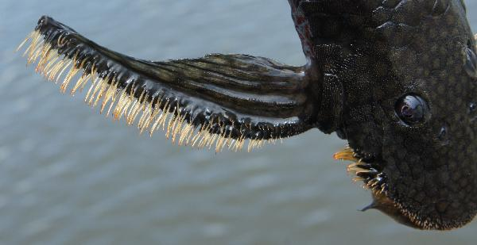

## This is the public GitHub repository for: 

[Collins, R. A., Bifi, A. G., de Oliveira, R. R., Ribeiro, E. D., Lujan, N. K., Rapp Py-Daniel, L. H., Hrbek, T. (2018) Biogeography and species delimitation of the rheophilic suckermouth-catfish genus _Pseudolithoxus_ (Siluriformes: Loricariidae), with the description of a new species from the Brazilian Amazon. Systematics and Biodiversity XXX, xxx-xxx, DOI: XXX.](http://dx.doi/XXX)

## Abstract

The rapids-dwelling suckermouth catfish genus _Pseudolithoxus_ was previously only known from the Guiana-Shield-draining Orinoco and Casiquiare river systems of Colombia and Venezuela, but new records expand this range considerably further into the Amazon basin of Brazil, and include occurrences from rivers draining the northern Brazilian Shield. These highly disjunct records are now placed in an evolutionary and phylogeographic context using a dated species tree constructed from mitochondrial (_Cytb_) and nuclear (_RAG1_) gene sequence data. Due to mito-nuclear discordance, we also delimit the putative species using statistical coalescent models and a range of additional metrics. We infer that at least two species of _Pseudolithoxus_ are present in the Amazon basin: _P. nicoi_, previously only recorded from the Casiquiare River but now also reported from the upper rio Negro, and a new species&mdash;which we describe herein&mdash;from south-draining Guiana Shield and north-draining Brazilian Shield drainages. Our data reject a simple model of Miocene vicariance in the group following uplift of the Uaupés Arch separating the Orinoco and Amazon systems, and instead suggest more complex dispersal scenarios through palaeo-connections in the Pliocene and also via the contemporary rio Negro and rio Madeira in the late Pleistocene. 

---

## Organisation

The repository is organised into folders comprising `data`, `manuscript`, and `scripts`. File paths for scripts in the `scripts` folder will be relative to the `data` folder, or uncommitted `temp` or `analyses` folders (for temporary files).

`data` contains raw data, input files for programs.

`scripts` contains command files for running the analyses, mostly `.R` or `.sh`.

`manuscript` contains the manuscript, bibliography files, figures, and results tables. 

### Notes

Some of the delimitations in the scripts refer differently to the paper. Here:
* nicoi.gr1 = _Pseudolithoxus nicoi_ "upper Negro"
* nicoi.gr2 = _Pseudolithoxus nicoi_ "Miuá"
* n.sp. = _Pseudolithoxus kinja_ 

## Files in the `data` folder

* `combo_cytb.tre`: \*Beast _CYTB_ gene tree (maximum clade consensus) for all taxa.
* `combo_rag1.tre`: \*Beast _RAG1_ gene tree (maximum clade consensus) for all taxa.
* `combo_species.tre`: \*Beast species tree (maximum clade consensus) for all taxa.
* `cytb_aligned.nex`: Aligned matrix of _CYTB_ for all taxa (nexus format).
* `cytb_pseudolithoxus_aligned.nex`: Aligned matrix of _CYTB_ for just _Pseudolithoxus_ (nexus format).
* `materials_examined_gps.csv`: GPS coords for some specimens from the materials examined section (for plotting on map).
* `mol_samples.csv`: Raw metadata for all samples used in the study; final spreadsheet is found in `tables/Supplementary_Table_S2.csv`.
* `pseudolithoxus_traits_m0.tsv`: Species delimitation models (see paper).
* `pseudolithoxus_traits_m1.tsv`: Species delimitation models (see paper).
* `pseudolithoxus_traits_m2.tsv`: Species delimitation models (see paper).
* `pseudolithoxus_traits_m3.tsv`: Species delimitation models (see paper).
* `rag1_aligned.nex`: Aligned matrix of _RAG1_ for all taxa (nexus format).
* `rag1_phased_aligned.nex`: Aligned matrix of phased _RAG1_ haplotypes for all taxa (nexus format).
* `rag1_pseudolithoxus_phased_aligned.nex`: Aligned matrix of phased _RAG1_ haplotypes for just _Pseudolithoxus_ (nexus format).
* `xml/*.xml`: All XML files to run \*Beast species trees and Bayes-factor species-delimitations.

## Files in the `scripts` folder

* `beast_run_delim.sh`: Shell script to run the \*Beast Bayes-factor species-delimitation models.
* `beast_run_speciesTree.sh`: Shell script to run the \*Beast species tree.
* `bf_calculations.R`: R script to process the \*Beast Bayes-factor species-delimitation results.
* `bf_calculations.xml`: XML files to launch the Bayes factor path sampling analyses.
* `genbank_functions.R`: Utility functions for making GenBank submission files.
* `genbank_submit.R`: R script for generating GenBank submission files.
* `jmodeltest.sh`: Shell script to run jModelTest.
* `maps_biogeog.R`: R script to make the map (Figure 3 in paper).
* `models_delim.txt`: Text file explaining the setup for the \*Beast Bayes-factor species-delimitation analysis.
* `models_speciesTree.txt`: Text file explaining the setup for the \*Beast species tree analysis.
* `run_phase.sh`: Shell script to run the program Phase (for phasing the _RAG1_ sequences into haplotypes).
* `sed_edit_xml.sh`: Script to create multiple XML files for multiple \*Beast chains.
* `species_delimitation.R`: R script to generate additional metrics for species delimitation (Table 2 in paper).
* `speciesTree_combiner.sh`: Shell script to combine multiple runs of \*Beast trees. 
* `traits_speciesTree.txt`: File to assign individuals to species for the \*Beast species tree. 
* `tree.R`: R script to plot the trees.

## Files in the `manuscript` folder

* `pseudolithoxus-novsp.bib`: Bibliography file (BibTex format).
* `pseudolithoxus-novsp.tex`: Manuscript main (LaTeX format).
* `tables/Supplementary_Table_S2.csv`: Metadata file for all samples in the study (Darwin Core flatfile format); includes all GenBank accessions.
* `tables/Table_1.csv`: Results of the Bayes factor species delimitations.
* `tables/Table_2.csv`: Table of species delimitation metrics.
* `figures/ctga14486_paratype.jpg`: Image of paratype.
* `figures/CYTB_geneTree.svg`: _CYTB_ gene tree.
* `figures/inpa3220_holotype.jpg`: Image of holotype.
* `figures/inpa43888_paratype.jpg`: Image of paratype.
* `figures/map_combined.svg`: Map final, all combined (Figure 3 in paper).
* `figures/map_nicoi.svg`: Inset left of map (Figure 3 in paper).
* `figures/map_pseudolithoxus.svg`: Base of map.
* `figures/map_south_america.svg`: Inset right of map.
* `figures/RAG1_geneTree.svg`: _RAG1_ gene tree.
* `figures/speciesTree.svg`: All taxa species tree.

