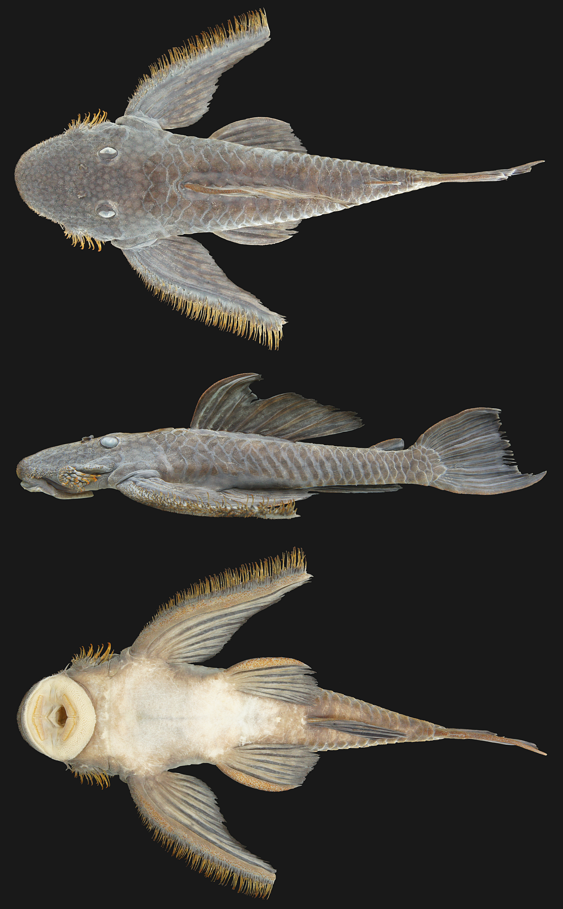
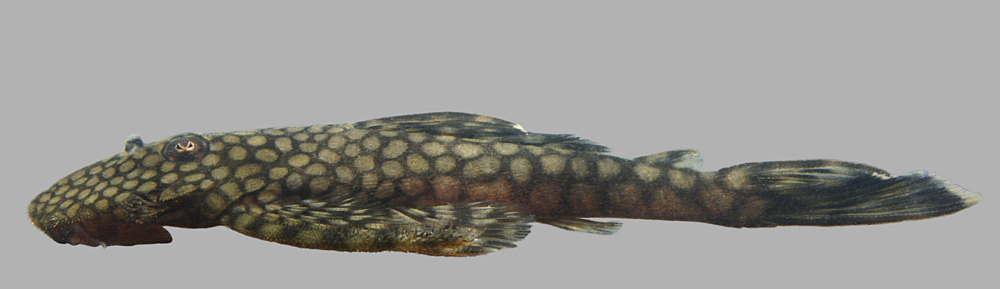

^1^Laboratório de Evolução e Genética Animal, Departamento de Biologia, Universidade Federal do Amazonas, Av. Rodrigo Otávio, 3000, Manaus, AM, Brazil

### Abstract

One suckermouth catfish species (Loricariidae, *Pseudolithoxus* sp. n.) collected on the survey we describe as new, and can be distinguished from its congeners on the basis of unique colour pattern: body with large pale spots on a dark background (versus bars in *P. kelsorum* and *P. tigris*, large dark spots on a pale background in *P. dumus*, and small white dots on a black background in *P. nicoi* and *P. anthrax*). This species represents the first *Pseudolithoxus* from the Amazon basin of Brazil.

Nós descrevemos uma nova espécie de acarí (Loricariidae, *Pseudolithoxus* sp. n.) coletada durante a pesquisa. Essa espécie pode ser diferenciada de suas congêneres baseado no seu padrão único de coloração: corpo de cor predominantemente escura com manchas pálidas (versus listras em *P. kelsorum* e P. *tigris*, grandes manchas escuras em um corpo de cor predominantemente clara em *P. dumus*, e pequenos pontos brancos em um corpo de cor escura em *P. nicoi* e *P. anthrax*). Essa espécie representa a primeira de *Pseudolithoxus* descrita para a Bacia Amazônica.


### Introduction

We also provide the description of a new suckermouth catfish species that was collected on the trip.


### Materials & methods

#### Measurements & meristic techniques

Measurements of preserved material were taken with dial callipers to a precision of 0.1 mm. All measurements and counts for symmetrical features were taken from the left side of the specimen. Morphometric measurements and meristic counts follow @Armbruster2003, and terminology for lateral plate rows follows @Schaefer1997. Counts of cheek plate odontodes included only the long, highly hypertrophied odontodes on the posterior part of the plate. The dorsal-fin spinelet is included as a spine, and the nuchal plate is not included in the predorsal plate-row count. Terminology of colour pattern follows @Kottelat2007.

#### Molecular methods

DNA barcodes were generated for three individuals for the *Pseudolithoxus* paratypes. Methodology for DNA extraction, PCR and sequencing follows @Colatreli2012. Chromatograms were assembled in Geneious 7.1.7 [@Kearse2012] and aligned manually using the translated amino acid sequence. Data were uploaded to GenBank in accordance with their official DNA barcode submission tool.


### Results

*Pseudolithoxus* sp. n., Figure 1.



#### Holotype

INPA 43888, male,  147.4  mm SL, Brazil, Pará State, Lower Rio Nhamundá (Amazon basin), -1.71782/-57.36856, November 2013, V. Nogueira Machado, E. Duarte Ribeiro, R. A. Collins.

#### Paratypes

INPA 43889, 16, 63.0-140.8 mm SL, collection data same as for holotype.

#### Diagnosis

Following @Armbruster2000, @Armbruster2008, and @Lujan2011kelsorum, key characters distinguishing *Pseudolithoxus* sp. n. from all ancistrin Loricariidae---except other *Pseudolithoxus*---are as follows: three rows of lateral plates on the caudal peduncle; lateral plates without pronounced keels; fully plated snout lacking tentacles; hypertrophied odontodes on the snout in both females and males; lack of whisker-like odontodes on the cheek plates; extremely hypertrophied odontodes on an elongated pectoral-fin spine in both females and males; sucking disk without fimbriae; and greater than 20 teeth per jaw ramus.

Within the genus *Pseudolithoxus*, *P*. sp. n. can be distinguished from: *P. tigris* and *P. kelsorum* by having a colour pattern comprised of spots (vs. bars); from *P. dumus* from having large pale spots on a dark background vs. large dark spots on a lighter background; and from *P. nicoi* and *P. anthrax* by having a colour pattern comprised of a dense pattern of large pale spots generally equal to or larger than pupil diameter on a dark background vs. dots considerably smaller than pupil diameter sparsely distributed on a black background.

#### Description

Morphometric measurements are presented in Table 1. Largest specimen collected was 147.4 mm SL (holotype). Body extremely dorso-ventrally compressed, with flattened surfaces both dorsally and ventrally. Shape of head-profile from dorsal view rounded to blunted-square. Head with pronounced medial ridge between nares and snout tip. Dorsal operculum of the iris present.

##### Table 1
Morphometric measurements for *Pseudolithoxus* sp. n. Except for SL, all values are in percentage of SL or HL. Landmark numbering scheme follows @Armbruster2003.

```{r echo=FALSE}
read_chunk("../analyses/morphometrics.R")
```

```{r morphometrics, echo=FALSE}
```

Sucking disk large, approximately as wide as is long, lacking fimbriae, and with the ventral surface bearing small buccal papillae. Maxillary barbels short. Teeth villiform and bicuspid. Lateral cusp of teeth roughly one-half to two-thirds the length of the medial cusp. Premaxillary teeth 42-81 (median 56, holotype 55). Dentary teeth 33-85 (median 65, holotype 69).

Short hypertrophied odontodes on snout and opercle in both females and males. Cheek plates evertible to 90°, bearing 21-35 long, distally-hooked hypertrophied odontodes (median 30, holotype 34). Pectoral-fin spines also carrying long, distally-hooked hypertrophied odontodes along almost their entire length in mature male specimens over around 100 mm. Short tentacules (fleshy sheaths partially detached from odontodes) present on snout and pectoral fins.

Pectoral fins extremely elongated, and when adpressed, reach to nearly the insertion of the anal fin in mature male specimens over approximately 100 mm. Fin-ray counts recorded as follows: dorsal fin II,7; pectoral fin I,6; pelvic fin I,5; anal fin I,5 (I,2 in one specimen); caudal fin I,14,I (I,13,I in one specimen); dorsal procurrent caudal-rays four (three in two specimens); and ventral procurrent caudal-rays four (three in two specimens). Adipose fin present with short, straight spine. All fin spines with odontodes. Branched fin-rays also bearing odontodes, but significantly fewer on the branched anal-fin rays of small specimens. Caudal fin emarginate with lower lobe slightly longer than upper.

Snout and flanks fully plated. Abdomen naked. Lateral plates carrying rows of small odontodes. Plating absent from small area at start of lateral line canal at conjunction with pterotic-supracleithrum, and from an area at the base of the pelvic fin. Plate counts recorded as follows: predorsal plate rows two; lateral mid-dorsal plates 19-21 (mode 20, holotype 20); lateral median plates 24; lateral mid-ventral plates 19-21 (mode 20, holotype 20); caudal-peduncle plate rows three; azygous pre-adipose plates one (two in one specimen); and interdorsal plate rows six-seven (mode seven, holotype six).

Colour pattern of preserved material comprises dense pale spots on a dark grey background giving the overall impression of dark reticulations. In life, the pale spots are a light olive-green colour (Fig. 2). Spotted pattern is present on the head, body and fins. Spots increase in size posteriorly, being generally smaller than the pupil on the snout, and as large as the orbit on the caudal peduncle. Abdomen pale with scattered melanophores. Caudal fin with thin, white distal band. Odontodes golden orange-yellow, with darker orange tips.



Sexual dimorphism is subtle in *Pseudolithoxus*. In mature individuals of *Pseudolithoxus* sp. n., the shape of the pelvic fin was seen to differ; in males the third branched ray is noticeably longer than the first branched ray, where in females it is roughly the same length. Males also appear to have longer pectoral-fin spines carrying longer odontodes.

#### Etymology

*Pseudolithoxus* sp. n. is named from the Latin adjective, meaning remote or secluded, and is in reference to the disjunct distribution of the species from the putative centre of diversity for the genus in the upper Orinoco (Lujan and Birindelli 2011). In the German aquarium literature, fishes of this genus are known as "Fliegerwelse" (flyer catfish) due to their elongated and wing-like pectoral-fins [@Seidel2005]. We propose the English vernacular name "Amazon flyer catfish", and propose the Portuguese vernacular name "acarí voador" for the species.

#### Ecology & distribution

The species is currently only known from one location on the main river stem of the lower Rio Nhamundá. The type series was collected in shallow (depth < 1.5 m), fast flowing water over a substrate of eroded bedrock. The fishes were living among the narrow cracks between the rocks, and were abundant at the sampling site. However, this type of  habitat was not frequently encountered on the lower Nhamundá, and we did not find the species associated with the more common woody-debris sites, or the rocky sites lacking any appreciable water current. Water temperature and conductivity were 28.3°C and 6 µs/cm. Syntopic species encountered during the night survey included: *Leporinus*, *Symphysodon*, *Cichla*, *Pimelodella* and *Tatia*. *Pseudolithoxus* was the dominant loricariid in this habitat.

A similar species has been reported in the aquarium trade literature under the tag name of *Pseudolithoxus* sp. "L385", a fish purportedly from the Rio Trombetas [@Seidel2005]. Based on the available pictures we hypothesise that this population also represents *P*. sp. n.

#### Molecular data

GenBank accession numbers are listed as follows for the three *Pseudolithoxus* sp. n. paratypes sequenced for COI: UFAM:CTGA:14422 (accession TBC); UFAM:CTGA:14483 (accession TBC); and UFAM:CTGA:14485 (accession TBC). Following the 'GenSeq' nomenclature of @Chakrabarty2013 these specimens bear the 'genseq-2 COI' annotation. The sequence data are also presented in Suppl. Material 3.


```{r echo=FALSE}
read_chunk("../analyses/tree.R")
```

```{r treecode, echo=FALSE, fig.width=7, fig.height=14, fig.cap="**Fig. 3.** Phylogenetic tree of DNA"}
```


### Discussion

#### Systematics
@Armbruster2000 described four *Lasiancistrus* from the Upper Orinoco drainage, species which were later moved by Isbrücker & Werner [@Isbrucker2001] to the new genus *Pseudolithoxus*. @Lujan2011kelsorum later added an additional barred species also from the upper Orinoco, *P. kelsorum*, to the genus. @Lujan2011kelsorum also list the homoplastic synapomorphies of *Pseudolithoxus* following @Armbruster2008, viz. "posteromedial invagination of ceratobranchial 5 present (vs. absent), dorsomedial process on pterotic-supracleithrum present (vs. absent), and three to eight vertebrae from the first normal neural spine behind dorsal fin to spine under preadipose plate (vs. nine or more)". The genus *Pseudolithoxus* was found by both @Armbruster2008 with morphological data, and @Covain2012 with molecular data, to be the sistergroup to *Ancistrus*+*Lasiancistrus*.

#### Biogeography
*Pseudolithoxus* sp. n. is the first of the genus reported from Brazil, and in particular it is the first recorded from the Amazon-draining southern rivers of the Guiana Shield, raising interesting biogeographic questions about the dispersal routes, vicariant events, and zoogeographic filters of the region [@Winemiller2008]. Whether the genus has a wider distribution than currently known awaits confirmation, but @Seidel2005 illustrate a fish purportedly from the Rio Guaporé (upper Madeira drainage) on the Brazil-Bolivia border, an even more disjunct location from the current known distribution of the genus on the Guiana Shield. Regardless, only further collections and a detailed molecular treatment of the genus will allow detailed hypotheses regarding the groups distribution to be tested.


### References
